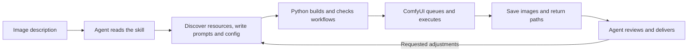

# auto-comfy-draw

[中文](README.md)

**Drive ComfyUI with natural language: turn an image description into prompts, workflows and batches of images.**

auto-comfy-draw is a skill for AI agents. You describe the image; the agent follows the skill to select existing models, write prompts and configure a Python driver that runs ComfyUI. The drivers can also be used as standalone command-line tools.

It is intended for people who already have ComfyUI and models and want conversational generation, batch variations and iterative adjustments. The Python drivers use only the standard library. Inference runs on the connected ComfyUI service.

## What to ask

- “Generate four wide views of a city skyline at dusk.”
- “Keep the previous model and LoRA, and try three more seeds.”
- “Give this reference image a watercolor style while keeping its composition as much as possible.”
- “Try a red bird and a blue bird with the same settings, two images each.”
- “Generate this portrait batch with face and hand detail passes.”

The agent handles commands and JSON, reuses confirmed preferences and asks only for missing information that matters. Reference images must first be placed in the server's input directory. Identity and composition preservation depend on the model, prompt and denoise strength.

## How it works



| Component | Responsibility |
|---|---|
| **Skill and agent** | Interpret the request, choose settings and execution path, write prompts, and inspect images when image-viewing tools are available |
| **Python drivers** | Parse inputs, derive seeds, build node graphs, call HTTP APIs, track jobs and handle output |
| **ComfyUI service** | Load models and LoRAs, sample, refine, upscale and save images on its execution device |

A typical run follows these steps:

1. **Discover resources.** Probe the service and read available checkpoint and LoRA filenames from node information.
2. **Configure the image.** Reuse or generate a JSON config with the model, base prompts, image description, dimensions and sampling settings.
3. **Plan the batch.** Expand prompt branches, assign seeds and output prefixes, and build ComfyUI API graphs.
4. **Check and submit.** An offline `--dry-run` previews every job. An online `--check` verifies nodes and resources. Actual runs also preflight their graphs before submitting each job to `/prompt`.
5. **Wait and collect.** Poll `/history/<prompt_id>` for each submitted job, then download images or report server-side paths. Failures, missing output and timeouts produce a nonzero exit status.
6. **Review and iterate.** The agent checks images against the request and adjusts prompts or seeds within the agreed scope and image count. Visual quality review belongs to the agent; the driver does not contain a visual scoring model.

## Capabilities

| Capability | `pipeline.py` | `pipeline_twopass.py` |
|---|---|---|
| Text-to-image, one optional LoRA, batches | Yes | Yes |
| Named prompts, branch selection, seed control | Yes | Yes |
| Image-to-image | `--init` / `--denoise` | — |
| Face/hand refinement and optional model upscaling | — | Yes |
| Offline preview and online preflight | Yes | Yes |
| Client downloads or server-side output | Yes | Yes |
| Resource discovery, config scaffolding, service startup | Yes | Use the base driver |

The base workflow is **checkpoint → optional LoRA → text encoding → sampling → decoding → saving**. Image-to-image loads and encodes a reference to supply the initial latent. The detail workflow adds face/hand processing and optional upscaling after decoding.

Both drivers share prompt parsing and config validation. The detail driver enables face and hand passes by default and requires their nodes and models; `--no-face` and `--no-hand` disable them.

## Requirements and integration

- **Python 3.7+**, with no additional Python package dependencies for the drivers.
- **A reachable ComfyUI HTTP service**, local or remote, with the required models installed.
- **An agent that can execute local commands** for conversational use; image review also requires image-viewing tools.
- Detail passes require **Impact Pack-related nodes and detection models**. Upscaling requires a corresponding upscale model. See [detail passes](docs/TWOPASS.md).

The workflows use the `CheckpointLoaderSimple`, CLIP, VAE and KSampler loading and sampling path. Defaults are oriented toward SDXL / Illustrious. A model appearing in discovery does not establish compatibility with this graph or a LoRA; check the loading requirements of other architectures first.

**Use as a skill:** place the tool folder in a skill discovery directory supported by your agent. Keep `SKILL.md`, all three Python modules, `config.schema.json`, the example config and `docs/`. For project-local use, a project `AGENTS.md` can point to this folder's `SKILL.md` for on-demand reading.

**Documentation ownership:** `SKILL.md` defines generation procedures, `AGENTS.md` holds project conventions, and workspace-level guidance records machine-specific addresses, paths and preferences. Detailed parameters live in the [usage reference](docs/USAGE.md).

## CLI quick start

Run these commands from the tool directory. Replace `model.safetensors` with an actual checkpoint filename returned by discovery. `./output` is an example directory the client is allowed to write.

```text
python pipeline.py --discover
python pipeline.py --scaffold --model model.safetensors --output-dir ./output --name city --prompts "a city skyline at dusk" --config config.city.json
python pipeline.py --config config.city.json --count 1 --seed-basis 42 --dry-run
python pipeline.py --config config.city.json --count 1 --seed-basis 42 --check
python pipeline.py --config config.city.json --count 1 --seed-basis 42
```

`--dry-run` prints all jobs and graphs without connecting, creating output directories or submitting jobs. `--check` connects but does not generate images; download mode uses a temporary file to verify directory write access. Scaffolding writes the specified config file, so check whether that destination can be overwritten.

For batch variations:

```text
python pipeline.py --config config.city.json --prompt "a {red|blue} bird" --count 2 --pick cycle --seed-basis 42
```

This generates one red bird and one blue bird in order. Top-level `|` separates prompts; pipes inside braces separate options. `cycle` rotates each group and does not enumerate every combination across multiple groups.

## Output and reproducibility

By default, ComfyUI saves images and the driver downloads them through `/view` into the configured `output_dir`. Use `--server-out <actual-server-output-root>` to keep server-side files and skip downloads. This parameter supports path reporting and sequence reads; it does not change ComfyUI's output settings. The detail driver's direct-output numbering requires the client to be able to read that root directory.

Logs include the base seed, queued task IDs and saved paths. Keep the config, expanded prompts, seeds and relevant environment information for reproduction. `--seed-fixed` shares a base seed across prompts but cannot guarantee identical composition or pixels.

Previously queued jobs may continue after a timeout or a partial submission failure. Inspect their IDs before deciding what to resubmit. Online preflight checks nodes and parameters, not GPU memory capacity or final image quality.

## Documentation and development

- [Usage reference](docs/USAGE.md): parameters, output modes, branches and compatibility.
- [Detail passes and experiments](docs/TWOPASS.md): dependencies, switches and reproducibility limits.
- [Prompt observations](docs/PROMPT_ENGINEERING.md): project experience with specific checkpoints and character LoRAs.
- [Example config](config.example.json) / [config contract](config.schema.json).

Run tests from the repository directory: `python -B -m unittest discover -s tests -v`. Personal configs and local working artifacts are excluded by `.gitignore`; the example config and schema are maintained with the repository.

[Example image](examples/example_output.png) · [MIT License](LICENSE)
