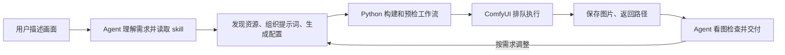

# auto-comfy-draw

[English](README.en.md)

**用自然语言驱动 ComfyUI：从画面描述，到提示词、工作流和批量出图。**

auto-comfy-draw 是一个供 AI agent 使用的 skill。你描述想要的画面，agent 按照 skill 的指引选择已有模型、组织提示词、配置参数，再通过 Python 驱动 ComfyUI 生成图片。它也可以作为独立命令行工具使用。

适合已经有 ComfyUI 和模型，希望通过对话完成出图、批量变体和反复调整的人。Python 驱动只使用标准库，实际推理由连接的 ComfyUI 服务执行。

## 安装：复制这段话给 agent

把下面整段发给你正在使用、能够访问本地文件并执行命令的 AI agent：

```text
帮我安装并配置这个 ComfyUI 出图 skill：
https://github.com/EliotOK/auto-comfy-draw

请检查当前 agent 支持的 skill 安装位置和已有安装，保留完整脚本、配置 Schema 与引用文档，并告诉我安装到了哪里。如果当前环境不支持 skill 自动发现，请用项目 AGENTS.md 引用它，并说明这种接入方式。
接着检查能否连接我的 ComfyUI；先沿用已有地址，本机没有配置时探测 127.0.0.1 的 8188、8189 端口，远程地址不明确时再问我。
连接后告诉我可用底模和 LoRA 的数量，帮我准备首次使用的兼容配置。缺少模型或节点时，请汇总缺失项、影响的功能与处理建议。需要下载模型、安装节点或启动服务时，先核对已有授权；授权不明确再问我。
本次只完成安装、连接检查和工作流预检，不生成图片。等我描述画面后再出图。
```

需要先有可用的 ComfyUI 服务和模型；这段引导会检查它们，安装 skill 本身不会自动安装 ComfyUI、模型或扩展节点。

### 首次连接会提示什么

| 检查结果 | 引导内容 |
|---|---|
| 连接成功 | 实际服务地址、可用底模与 LoRA 数量、准备使用的输出模式 |
| 连接失败 | 尝试的地址和原因，再确认服务状态或远程连接信息 |
| 没有底模 | 明确暂时不能生成，并说明兼容底模和服务端目录要求 |
| 没有 LoRA | 提示 LoRA 可选；使用底模仍可生成 |
| 缺少指定模型、参考图或节点 | 汇总可检测问题，并给出补齐或调整方案 |
| 缺少精修依赖 | 说明影响脸部、手部或放大中的哪一步，由用户决定补齐还是调整流程 |
| 预检通过 | 简短说明准备好的配置，接收画面描述；已有出图请求则继续执行 |

脚本不会自动下载资源，也不会在预检失败后悄悄切换模型或关闭精修。缺失节点本身的模型列表尚不可检查，安装节点后需再次预检。

## 你可以这样使用

- “画一张傍晚的城市天际线，横构图，出 4 张。”
- “沿用上次的模型和 LoRA，换一组种子再出 3 张。”
- “把这张参考图改成水彩风格，尽量保留原来的构图。”
- “同一套参数分别试红色和蓝色的小鸟，各出 2 张。”
- “用脸部和手部精修流程生成这组人物图。”

agent 负责命令和 JSON 配置，优先复用已确认的偏好，只在缺少关键信息时追问。参考图需要先放入服务端的 input 目录；主体保真和构图保留程度仍取决于模型、提示词及重绘强度。

## 它如何运作



这里有三个分工明确的部分：

| 部分 | 负责什么 |
|---|---|
| **Skill 与 agent** | 理解需求，选择参数和执行路径，撰写提示词，在具备图像查看能力时检查结果 |
| **Python 驱动** | 解析配置和提示词，派生种子，构建节点图，调用 HTTP API，跟踪任务并处理输出 |
| **ComfyUI 服务** | 加载模型和 LoRA，在其运行设备上采样、精修、放大并保存图片 |

一次典型执行会经过以下步骤：

1. **发现资源**：探测服务是否可达，通过节点信息读取可用底模和 LoRA 文件名。
2. **配置画面**：复用已有 JSON 或生成新配置，设置模型、基础提示词、画面描述、尺寸和采样参数。
3. **规划批次**：展开提示词分支，为每张图片确定种子和输出前缀，构建 ComfyUI API 格式的工作流。
4. **检查与提交**：离线 `--dry-run` 可预览全部任务；在线 `--check` 汇总节点、资源及参数问题，并给出处理建议。实际生成也会自动预检，然后逐项提交到 `/prompt`。
5. **等待与取图**：按返回的任务 ID 轮询 `/history/<prompt_id>`，下载图片或报告服务端保存路径。失败、输出缺失或超时返回非零退出状态。
6. **检查与迭代**：agent 根据原始要求检查图片，必要时在约定的数量和范围内调整提示词或种子。图像质量检查由 agent 完成，驱动本身不包含视觉评分器。

## 能做什么

| 能力 | `pipeline.py` | `pipeline_twopass.py` |
|---|---|---|
| 文生图、单个可选 LoRA、批量生成 | 支持 | 支持 |
| 命名提示词、分支抽选、种子控制 | 支持 | 支持 |
| 图生图 | 支持 `--init` / `--denoise` | — |
| 脸部与手部精修、可选模型放大 | — | 支持 |
| 离线干跑、在线预检 | 支持 | 支持 |
| 下载到客户端或保留服务端输出 | 支持 | 支持 |
| 资源发现、生成配置、启动服务 | 支持 | 使用基础脚本 |

基础工作流是 **底模 → 可选 LoRA → 文本编码 → 采样 → 解码 → 保存**。图生图通过读取并编码参考图提供初始 latent；精修工作流则在解码后追加脸部、手部处理和可选放大。

两份驱动共用提示词解析和配置校验。twopass 默认开启脸部和手部精修，需要对应节点及模型；可用 `--no-face`、`--no-hand` 关闭。

## 环境与接入

- **Python 3.7+**；驱动无额外 Python 包依赖。
- **可访问的 ComfyUI HTTP 服务**，位于本机或远程设备，并已安装所需模型。
- **可执行本地命令的 agent**，用于对话式操作；看图质检还需图像查看能力。
- 精修需要 **Impact Pack 相关节点及检测模型**，放大需要对应放大模型。详见 [精修说明](docs/TWOPASS.md)。

现有工作流面向 `CheckpointLoaderSimple`、CLIP、VAE 和 KSampler 这条加载与采样路径，默认参数偏向 SDXL / Illustrious。模型能出现在资源列表中，不代表它与工作流或 LoRA 架构相容；使用其他架构时应先确认其加载方式。

**作为 skill 使用**：将本工具目录放入所用 agent 支持的 skill 发现目录，保留 `SKILL.md`、三份 Python 模块、`config.schema.json`、示例配置和 `docs/`。也可以在项目 `AGENTS.md` 中指向本目录的 `SKILL.md`，按需读取。

**文件如何分工**：`SKILL.md` 维护出图流程；`AGENTS.md` 维护项目约定；工作区级说明记录本机地址、路径和偏好。详细参数集中在 [运行参考](docs/USAGE.md)。

## 命令行快速开始

以下命令在本工具目录执行。将 `model.safetensors` 替换为 discover 返回的实际模型文件名；`./output` 是允许客户端写入的示例位置。

```text
python pipeline.py --discover
python pipeline.py --scaffold --model model.safetensors --output-dir ./output --name city --prompts "a city skyline at dusk" --config config.city.json
python pipeline.py --config config.city.json --count 1 --seed-basis 42 --dry-run
python pipeline.py --config config.city.json --count 1 --seed-basis 42 --check
python pipeline.py --config config.city.json --count 1 --seed-basis 42
```

`--dry-run` 不连接服务、不创建输出目录、不提交任务，打印全部 jobs 和 graphs。`--check` 连接服务但不出图；下载模式会用临时文件验证目录写入。scaffold 会写入指定配置文件，运行前应确认目标文件可覆盖。

需要批量变体时，例如：

```text
python pipeline.py --config config.city.json --prompt "a {red|blue} bird" --count 2 --pick cycle --seed-basis 42
```

这会按顺序生成红色、蓝色各一张。顶层 `|` 分隔不同 prompt，花括号内的 `|` 表示选项；`cycle` 逐组轮转，不会自动枚举多组之间的全部组合。

## 输出与复现

默认由 ComfyUI 保存图片，再通过 `/view` 下载到配置中的 `output_dir`。若希望保留服务端文件并跳过下载，使用 `--server-out <服务端实际输出根>`。该参数用于路径报告和编号读取，不会改变 ComfyUI 的输出设置；twopass 的直写编号要求客户端能读取该根目录。

脚本打印基准种子、排队任务 ID 和保存路径。复现时保留配置、展开后的提示词、种子及相关环境信息。`--seed-fixed` 可以让不同 prompt 共用基准种子，但不保证构图或像素完全相同。

超时或中途提交失败后，已排队任务可能继续执行，应根据任务 ID 检查状态后再决定补交。在线预检检查的是节点与参数条件，不保证显存足够或成品达到预期画质。

## 文档与开发

- [运行参考](docs/USAGE.md)：参数、输出模式、分支语法和兼容性。
- [精修与实验说明](docs/TWOPASS.md)：依赖、精修开关和复现边界。
- [提示词经验](docs/PROMPT_ENGINEERING.md)：特定底模与角色 LoRA 的项目观测。
- [配置示例](config.example.json) / [配置契约](config.schema.json)。

从仓库目录运行测试：`python -B -m unittest discover -s tests -v`。个人配置和本地工作产物通过 `.gitignore` 排除，示例配置和配置契约随仓库维护。

[示例图片](examples/example_output.png) · [MIT License](LICENSE)
